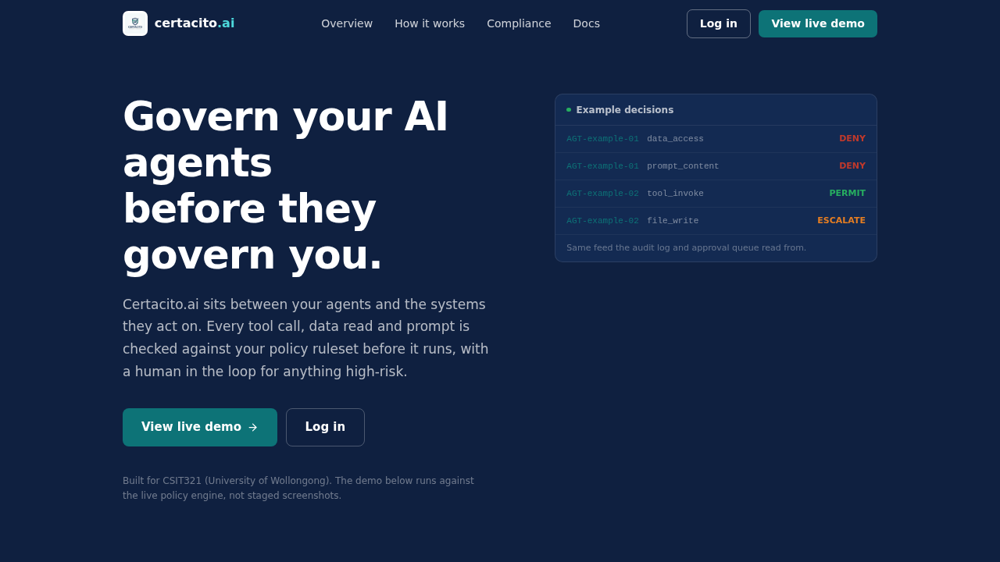
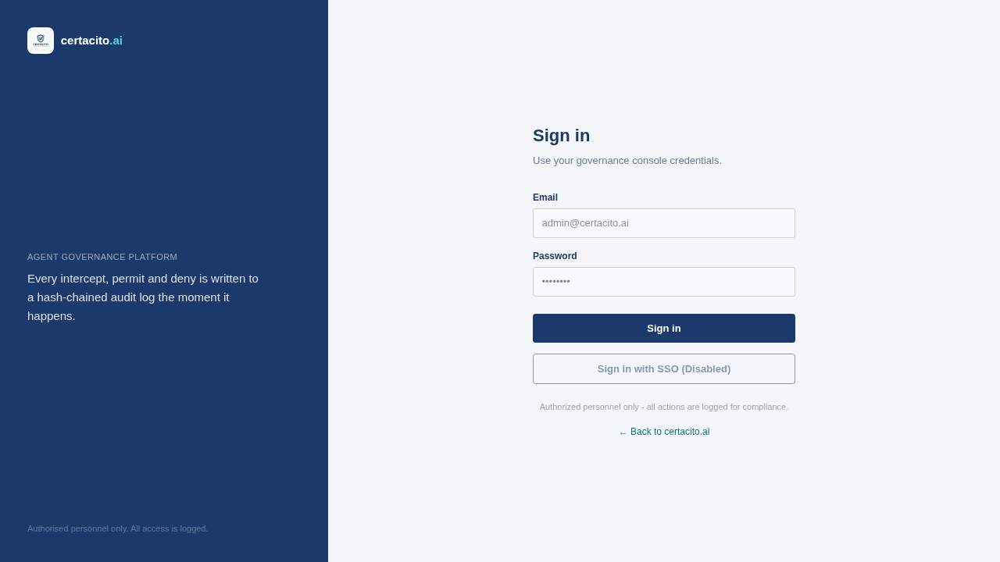
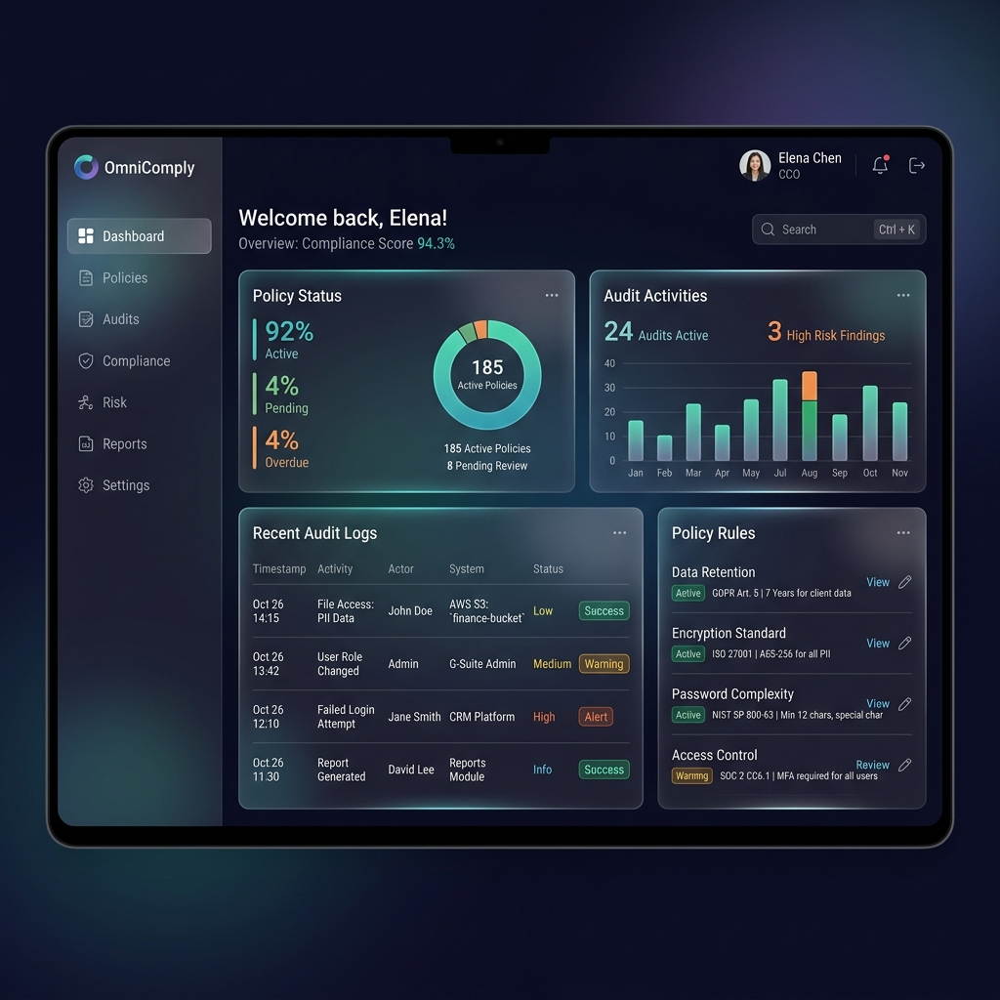
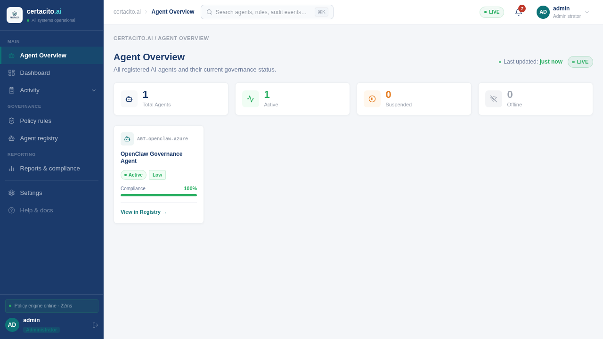
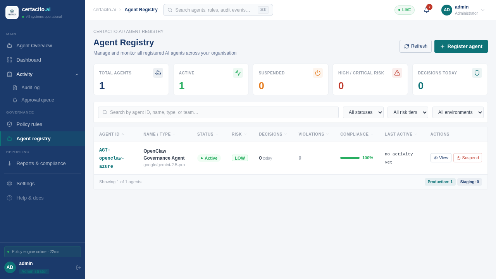
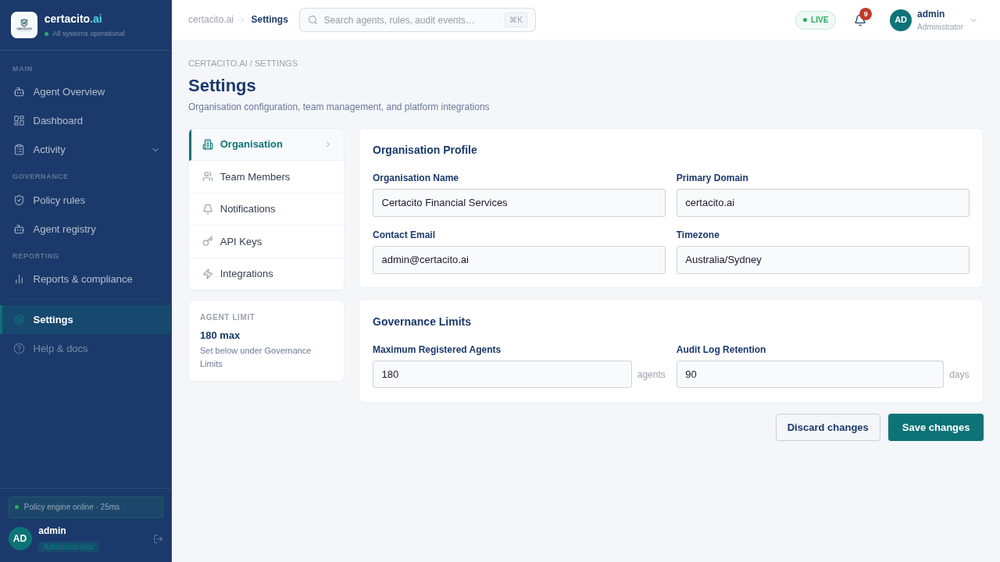

# Interface Design - what changed since A3 and why

A4 appendix. A3 presented eight high-fidelity Figma screens. A4 is those screens
implemented as a working React app fed by the real API. This doc lists where the
implementation deviates from the A3 designs and the reason for each change.

## 1. What stayed the same

The A3 design system survived contact with implementation almost untouched:

- Colour system and its "one job per colour" rule (navy structure, teal active/permit,
  red critical/deny, green permit/pass, amber escalate).
- Persistent navy sidebar, breadcrumb header, card-on-grey layout.
- Unified risk/outcome badges - colour always paired with a text label (WCAG 2.1 AA,
  risk is never conveyed by colour alone).
- Screen set and the two persona journeys (Compliance Officer triage path,
  DevSecOps configuration path).
- Expandable row detail on the audit log and approval queue.

## 2. What changed, and why

| # | A3 design | A4 implementation | Why |
|---|-----------|-------------------|-----|
| 1 | Sign-in via Azure AD | Local JWT login (email + bcrypt password), SSO button kept as inactive placeholder | Live on an Azure VM in australiaeast. JWT + RBAC gives the same role-gated behaviour to demo; the SSO swap is isolated inside `auth.py`. |
| 2 | Typography: Inter / JetBrains Mono | Arial / Courier New system stack | Licensing-free system fonts render identically across marker machines with zero font loading. Visual intent (prose vs system identifiers) is preserved. Revisit for production. |
| 3 | Static mock numbers in every panel | All KPIs, feeds, charts and tables driven by the live API; WebSocket push for instant updates | The A3 prototype only had to look real. A4 has to be real - a live simulator (~4 events/min) plus the OpenClaw agent feed the same pipeline a customer deployment would. |
| 4 | Audit "Export modal" | Direct Export CSV (client-side) + Export PDF (print stylesheet) + a new **Verify chain** button | Verify chain surfaces the tamper-evidence story in one click during demos - it re-walks the whole SHA-256 chain server-side. The modal added a step without adding value. |
| 5 | No landing page in A3 | Public marketing landing page before login | Exhibition feedback: visitors need the "what is this and why should I care" story before the console. Also carries the group branding. |
| 6 | Audit detail drawer showed one exemplar record | Detail row renders the actual selected entry: masked payload, its own chain hash, previous-entry hash, real decision trail | Markers click more than one row. Mock detail on real rows read as broken. |
| 7 | Notifications area (bell) with static badge | Badge counts live pending approvals + criticals | Same reason as 3. |
| 8 | 2-second polling everywhere (A3 assumed it) | WebSocket-first, 10 s fallback poll | Polling three endpoints every 2 s tripped our own API rate limit after a minute on screen. The socket is instant and cheaper. |

## 3. Screens as implemented

All ten screens of the implemented console, captured from the running Azure
deployment with the simulator on (source files in `docs/screenshots/`). The A3
feedback asked to see every designed screen, so they are all here, ordered the
way a user meets them: entry, then the Compliance Officer triage journey, then
the DevSecOps configuration journey.

**Landing page** - the public "what is this" story before any login.

**Login** - JWT email/password with the SSO placeholder (change 1 in section 2).

**Dashboard** - live KPIs, intercepted-actions feed, risk mix. The Compliance
Officer's home screen.

**Approval queue** - the human-in-the-loop worklist; expandable rows carry the
full decision context, approve/deny act on the live API.

**Audit log** - the hash-chained record with per-row chain hashes and the
one-click Verify chain action.

**Reports and compliance** - exportable compliance posture over time.

**Agent overview** - fleet status at a glance; the DevSecOps entry point.

**Agent registry** - per-agent detail, permitted action types, live counters.

**Policy rules** - policy CRUD plus the pre-built rule library.

**Settings** - organisation, team, notifications, API keys, integrations. Team
members and API keys are live (real users from the API, keys issued and revoked
from this screen); the organisation form and notification toggles are
client-side only in this release, and the integrations tab honestly reports
every integration as not connected rather than faking a status.

## 4. Sponsor/supervisor feedback applied

- "Interception-first framing" (Anthony, A3 review) - the dashboard leads with the
  live intercepted-actions feed, not agent inventory.
- "Understandable in a few minutes by someone new" (supervisor email, June) - the
  landing page + healthcare demo scenario (`POST /api/v1/demo/healthcare-scenario`)
  give a self-contained walkthrough.

## 5. A3 marking feedback applied

The A3 assessment feedback listed specific improvements. Point by point:

| A3 feedback | What we did in A4 |
|-------------|-------------------|
| "Only a limited number of interface screens are presented" | All ten screens are implemented and shown in section 3, captured from the live system - none are mockups |
| "Additional screenshots for all designed screens would make the screen flow even clearer" | The section 3 gallery is ordered along the two persona journeys, so the flow reads top to bottom |
| Design approval "should be presented more consistently" | The approval record now lives in exactly one place - the sign-off box in the contribution table appendix - and no other document makes an approval claim |
| "Provide additional user testing or usability evaluation" | New Usability Evaluation appendix: a heuristic walkthrough and WCAG 2.1 AA audit of the live deployment, plus the sponsor, supervisor and exhibition feedback and what each changed |
| "Continue implementing the frontend and backend to demonstrate the complete governance platform" | The A4 submission is that: the full platform live on Azure, 105 passing tests, and a real agent (OpenClaw) governed through it |
| "Ensure all group members actively contribute during demonstrations and clearly explain their individual design contributions" | Each member's individual contribution is recorded and signed in the contribution table appendix |
